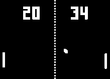

# PongClock



PongClock is a unique clock application that displays the current time using a Pong-style game interface. The clock uses the Pong game mechanics to represent the hours and minutes of the current time.

## Demo

Check out the live demo of PongClock at [pongclock.com](https://pongclock.com).

## Features

- Displays the current time using a Pong-style game interface
- The player scores represent the hours and minutes of the current time
- Authentic player logic simulates realistic paddle movement, creating an engaging gameplay experience
- The speed of the ball increases with each paddle impact, leading to a dynamic and captivating game of Pong that's hard to take your eyes off of
- Responsive design that adapts to different screen sizes
- Minimal and intuitive user interface
- Sound effects for a more immersive experience
- Debug screen for advanced users to view additional information

## Installation

1. Clone the repository:
git clone https://github.com/RchGrav/PongClock.git

2. Navigate to the project directory.

3. Open the `index.html` file in your web browser.

## Usage

- The left player's score represents the current hour in 24-hour format.
- The right player's score represents the current minute.
- The ball movement and speed are synchronized with the current time.
- The game automatically updates every second to reflect the current time.

### Mobile Controls
- Tap the screen to toggle sound on and off.
- Long press on the screen to toggle the debug screen.

### Desktop Controls
- Click anywhere on the browser window or the Pong playfield to toggle the sound on and off.
- Press the \` key (backtick) to toggle the debug screen.

## Folder Structure
```PongClock/
├── css/
│   └── styles.css
├── js/
│   └── script.js
├── fonts/
│   └── ScoreFont.ttf
├── index.html
└── webfont.js
```

- The `css` folder contains the CSS file (`styles.css`) for styling the clock interface.
- The `js` folder contains the JavaScript file (`script.js`) that handles the game logic and time synchronization.
- The `fonts` folder contains the custom font file (`ScoreFont.ttf`) used for displaying the scores.
- The `index.html` file is the main HTML file that structures the clock interface.
- The `webfont.js` file is a library for loading and using custom web fonts.

## Dependencies

- [webfont.js](https://github.com/typekit/webfontloader) - A library for loading and using custom web fonts.

## Contributing

Contributions are welcome! If you have any ideas, suggestions, or bug reports, please open an issue or submit a pull request.

## License

This project is licensed under the [MIT License](LICENSE).

## Acknowledgements

- [WebFont Loader](https://github.com/typekit/webfontloader) - Copyright (c) 2010-2017 Adobe Systems Incorporated, Google Incorporated.
  Licensed under the [Apache License, Version 2.0](https://github.com/typekit/webfontloader/blob/master/LICENSE).


